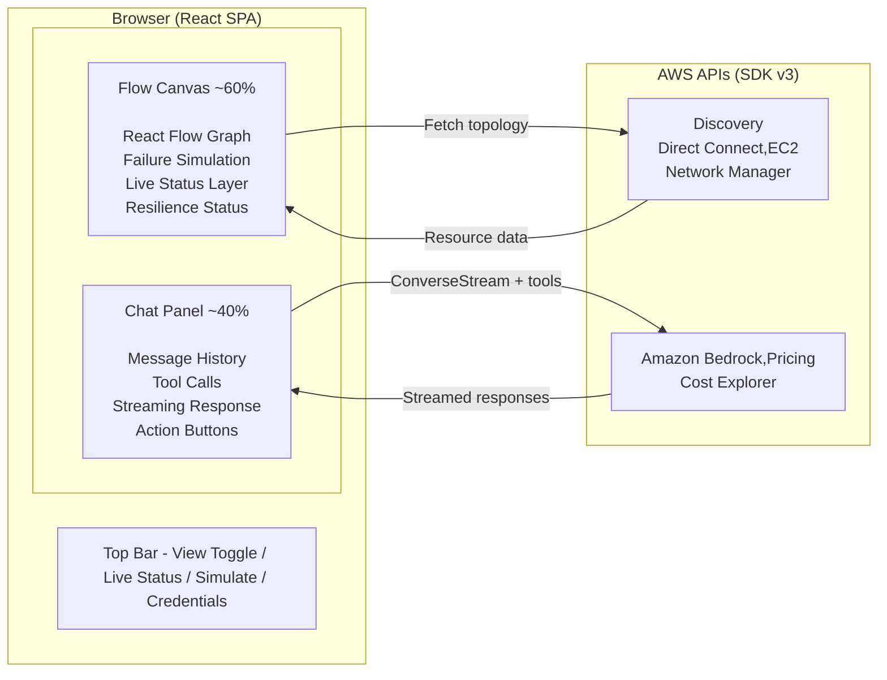

# Network Resilience Agent

A solution that helps customers understand and improve the resilience of their AWS Direct Connect network through four key capabilities:

1. **Discover** - Automatically discovers your AWS Direct Connect topology by querying live AWS APIs (Direct Connect, EC2, Network Manager) to map all connections, virtual interfaces, gateways, VPCs, Cloud WAN resources, and their relationships
2. **Visualize** - Renders the discovered topology as an interactive network diagram, showing the full path from customer on-premise sites through DX locations, gateways, and into AWS regions and VPCs
3. **Recommend** - Assesses your topology against AWS Direct Connect resiliency best practices and provides actionable recommendations, visualized as green dashed ghost overlays on the diagram
4. **Chat** - An AI-powered chat agent (Amazon Bedrock) that understands your topology context and can answer questions, explain trade-offs, provide live pricing estimates, query actual costs, and suggest specific steps to improve resilience

## Table of Contents

1. [Running the Application](#1-running-the-application)
2. [Solution Architecture](#2-solution-architecture)
3. [Cross-Account Discovery](#3-cross-account-discovery)
4. [Resilience Status](#4-resilience-status)
5. [Recommendation Engine](#5-recommendation-engine)
6. [AI Chat Agent](#6-ai-chat-agent)
7. [Interactive Features](#7-interactive-features)
8. [Maintenance & Snapshot Sharing](#8-maintenance--snapshot-sharing)
9. [Scope Limitations](#9-scope-limitations)

For detailed visualization reference (node types, edge types, layout engine, live status layer, failure simulation, canvas lock), see **[VISUALIZATION.md](dx-visualizer/docs/VISUALIZATION.md)**.

## 1. Running the Application

### 1.1 Prerequisites

- Node.js v20.19+ or v22.12+ (required by Vite 8)
- npm

### 1.2 Quick Start

```bash
cd dx-visualizer
npm install
npm run build
npm run preview
```

On first launch the canvas is empty behind a welcome card — pick **Connect AWS** to enter live credentials, or **Use demo data** to load a mock scenario. Demo scenarios are available via the top bar dropdown once a topology is loaded:

### 1.3 Connect to AWS

Click **Connect AWS** in the top bar and authenticate with either **SSO** (AWS IAM Identity Center, recommended for short-lived auto-expiring credentials) or **Access Key** (temporary credentials only — Access Key ID, Secret, and Session Token). The visualizer then fetches live topology from your networking account.

For credential options, IAM permissions, SSO backend deployment, cross-account setup, and troubleshooting, see **[SETUP.md](dx-visualizer/docs/SETUP.md)**.

### 1.4 Local Development Only

```bash
npm run dev            # Vite dev server on :5173 (hot reload, mock data)
```

> **Note:** `npm run dev` invokes build-time dependencies (`lightningcss` MPL-2.0, `caniuse-lite` CC-BY-4.0). These are **not bundled** into the production output. Use this mode for local development only — do not distribute.

### 1.5 Production Build & Distribution

```bash
npm run build          # Production build — output contains only MIT/Apache/BSD licensed code
npm run preview        # Preview production build locally
./scripts/package.sh   # Create distributable zip (start.sh/start.bat included)
```

> The commands above run the app on **localhost**, which is all you need to evaluate it — the SPA calls AWS APIs directly from the browser, so there's no application server to host. `npm run build` emits a **static bundle** (`dist/`), so you're free to host it your own way (S3 + CloudFront, an nginx container on EKS/ECS, any static web server). Hosting elsewhere doesn't change the credential model or IAM policy. See **[Building for Production in SETUP.md](dx-visualizer/docs/SETUP.md#7-building-for-production-optional)** for hosting notes.

## 2. Solution Architecture



### 2.1 Technology Stack

| Layer | Technology |
|-------|-----------|
| **UI** | React 19 + TypeScript, Vite 8, Tailwind CSS v4 |
| **Graph** | @xyflow/react 12 (React Flow) |
| **State** | Zustand 5 |
| **AWS SDK v3** | Direct Connect, EC2, Network Manager, CloudWatch, Health, Bedrock Runtime, Cost Explorer, Pricing, STS, Organizations, IAM, SSM (region-name lookup) |
| **Chat rendering** | react-markdown |

### 2.2 Data Flow — Multi-Region Auto-Discovery

The fetch logic in `fetch-topology.ts` is structured into five phases:

1. **Phase 1 (Global)** — Fetch DX Gateways, DX Gateway Associations, and Cloud WAN (Core Networks, Attachments, Peerings). These are global services that work from any region.
2. **Phase 2 (Discover)** — Collect all relevant regions from DX Gateway association regions + Cloud WAN edge locations + Cloud WAN attachment locations + DX Gateway attachment VIF regions (via `DescribeDirectConnectGatewayAttachments`, which reveals regions where connections/LAGs live that the regional APIs won't expose). No manual region selection required.
3. **Phase 3 (Per-Region)** — For each discovered region, fetch DX Connections, VIFs, LAGs, DX Locations, VPCs, TGWs, TGW Route Tables, TGW Attachments, TGW Peering Attachments, VPC Peerings, VPC Route Tables, VPN Gateways, VPN Connections, and Customer Gateways in parallel. `DescribeLocations` is called per region so the merged set includes each regional endpoint's location names (deduped by `locationCode`).
4. **Phase 4 (Merge)** — Deduplicate and merge all regional results into a single `TopologyData` object.
5. **Phase 5 (Enrich, optional)** — If spoke account IDs are provided, assume IAM role in each spoke account and fetch VPCs across discovered regions to enrich cross-account VPCs with name/CIDR.


## 3. Cross-Account Discovery

The app targets the **networking account** — no management account or AWS Organizations access required.

### 3.1 What the Networking Account Already Sees

Without any cross-account role assumption, the networking account can see:

- **All DX connections, VIFs, DX gateways, associations** — it owns them
- **All TGW attachments** including cross-account VPC attachments — each attachment has `resourceOwnerId` (spoke account ID) and `resourceId` (VPC ID)
- **All Cloud WAN attachments** with the same cross-account visibility
- **VPN connections and Customer Gateways** it owns

Cross-account spoke VPCs are automatically discovered from TGW attachment metadata — no IAM role assumption into spoke accounts is needed. The trade-off is that only the VPC ID and owner account are visible (not VPC name or CIDR), since those details require API calls within the spoke account.

### 3.2 VPC Enrichment (Optional)

For richer VPC detail (name, CIDR), users can optionally provide spoke account IDs and an IAM role name in the credentials modal. The app will:

1. Assume the specified role (default: `NetworkReadOnlyRole`) in each spoke account via STS
2. Fetch VPCs from all auto-discovered regions
3. Merge the enriched VPC data (name, CIDR, tags) into the topology, replacing the lightweight TGW-attachment-only entries

This is entirely optional — the baseline works with zero cross-account setup.

For step-by-step instructions on setting up cross-account IAM roles and trust policies, see **[Cross-account VPC enrichment in SETUP.md](dx-visualizer/docs/SETUP.md#6-cross-account-vpc-enrichment-optional)**.

## 4. Resilience Status

An expandable Resilience Status card sits in the bottom-left corner of the canvas, always visible on top of the diagram. The card aggregates at the top and breaks out a dedicated section for each DX Gateway below.

### 4.1 SLA Tiers

| Tier | Requirement | SLA |
|------|-------------|-----|
| **Single Connection** | 1 or more connections (any configuration below High) | 95% per Connection |
| **High Resiliency** | Connections at 2+ DX locations | 99.9% |
| **Maximum Resiliency** | 2+ connections per location at 2+ locations | 99.99% |

Figures reflect the tiers published on the [AWS Direct Connect SLA](https://aws.amazon.com/directconnect/sla/) page. The 99.9% and 99.99% SLAs also require an Enterprise Support plan (and, for 99.99%, a Well-Architected Review) — the engine surfaces these as attestation-only informational checks since they can't be detected via API.

### 4.2 Per-DX-Gateway Assessment

Each DX Gateway gets its own card row showing its current tier, target tier, a "Protection Coverage" checklist (location / device redundancy), and an upgrade path. The target tier is selectable per gateway: click **High** or **Maximum** on the DXGW row (or on the ghost customer-site zone in the canvas) to change what the ghost overlay recommends. In multi-DXGW topologies, a **bulk target picker** in the top bar applies the same target to every gateway at once.

DXGW rows are sorted to match the canvas's top-to-bottom order so list entries map by eye to their nodes. **Hovering a DXGW row** wraps the matching DXGW node on the canvas in a rotating conic-gradient border — useful for pinpointing a specific gateway in dense topologies without triggering the in-canvas path-dimming.

The bulk target pill reflects each gateway's **effective** target after the engine's auto-escalation (a DXGW already at High is escalated toward Max for assessment purposes). When targets differ across gateways, the pill shows **Mixed** with a tooltip breakdown (e.g., "3 at Max, 2 at High").

**Unattached DX Gateways** (zero VIFs) have no DX-side traffic path, so SLA tiering doesn't apply. Their card row shows an **Unattached** badge in place of the tier chip, hides the upgrade path and Protection Coverage checklist, and surfaces a short note describing what's missing (no VIFs, no associations, or both). The bulk target picker excludes them from its "Applies to X of Y" count and skips them when applying a tier, and they don't keep the picker visible when every remaining DXGW is already at Maximum.

### 4.3 Best Practice Checklist

Below the per-DXGW breakdown, a checklist shows operational best practices with severity-colored indicators (shown only in the **Recommended** view so Current State stays focused on coverage checks):

- All connections available (critical if any are down)
- All Virtual Interfaces operational (critical if any BGP sessions are down)
- VPN backup path configured (warning if missing)
- BFD enabled (info — must be verified on-premise)
- Enterprise Support plan in place (info, shown when the target tier is 99.9% or 99.99%)
- Well-Architected Review completed (info, shown when the target tier is 99.99%)

The card can be expanded inline or opened as a fullscreen modal. A **Download Report** button on the expanded card produces a standalone HTML resilience report with per-DXGW executive summaries, coverage blocks, and an upgrade path keyed to each gateway's selected target tier. The report's Best Practices section is grouped into **Architecture** / **Configuration** / **Operations**, with each item flagged as a live alert, gap, verify (attestation-only), or already-applied, and omits any practice already covered by the resilience tier above to avoid duplication.

## 5. Recommendation Engine

The recommendation system has two independent categories:

1. **Resiliency recommendations** analyze the topology structure for single points of failure and recommend the **additional resources** that would close each gap — moving a DX Gateway toward the High / Maximum tiers defined in [Section 4](#4-resilience-status). In the **Recommended** view these appear as **green dashed ghost nodes and edges** overlaid on the existing diagram. Resiliency rules run **per DX Gateway** — each DXGW is assessed independently against its own target tier, so accounts with multiple DXGWs get one set of ghost overlays per gateway.
2. **Best practice checks** surface operational and configuration findings with a severity, shown in the Resilience Status checklist and (for faults) as colored edges in Live Status mode.

Tier-gap rules are advisory (Info) — upgrading to High / Maximum is a product decision, not a fault. Only actual faults (`vif-down`, `connection-not-available`) are flagged Critical.

### 5.1 How Resiliency Recommendations Are Generated

There are **many valid ways** to reach **High** or **Maximum** resiliency for any given topology. The engine could, for example, suggest standing up an entirely new DX location and placing a fresh logical device there. Rather than enumerate every possible path, this solution applies three guiding principles so the recommended overlay is the smallest, safest change that closes each gap:

1. **Never remove existing resources.** Recommendations only ever *add* infrastructure (the green dashed ghost nodes and edges). No existing connection, LAG, location, device, or gateway is ever proposed for removal or replacement — your current topology is always preserved intact.
2. **Reuse only what can be safely shared.** Before proposing anything new, the engine reuses your existing DX locations, on-premise sites, and customer gateways in on-premise wherever they can help reach the target. These are shared, physical/facility-level resources, so extending them in place is safe. However, resources whose whole purpose is redundancy are never reused — specifically AWS logical devices and customer gateways located in a DX location. For these, the engine always proposes a new, separate instance rather than leaning on an existing one, since reusing them would leave the very failure domain the recommendation is meant to close. For example, a single-location DX Gateway targeting Maximum keeps its existing location but gets a new second logical device added at that location — closing the device-failure gap with genuinely independent hardware rather than reusing the device that already exists.
3. **Fewest steps to the target.** Each rule fires only for the specific gap it closes, and stops at the selected target tier. Reaching High requires a second location, so the engine recommends exactly that and nothing more; the extra per-device redundancy only appears when the target is Maximum. The result is the *minimal* set of additions that moves you from your current tier to the selected target.

Genuinely new infrastructure — such as a brand-new DX location and its logical device — is proposed only when the target tier cannot be met by extending the resources you already have (for example, a single-location topology can only reach High by adding a second, geographically separate location).

### 5.2 Basis for Recommendations

Every rule encodes an AWS-documented best practice from:

1. **[AWS Direct Connect Resiliency Toolkit](https://docs.aws.amazon.com/directconnect/latest/UserGuide/resilency_toolkit.html)**
2. **[AWS Well-Architected Framework — Reliability Pillar](https://docs.aws.amazon.com/wellarchitected/latest/reliability-pillar/welcome.html)**
3. **[AWS Direct Connect User Guide](https://docs.aws.amazon.com/directconnect/latest/UserGuide/best-practices.html)**

For the full rule-by-rule reference — every resiliency rule and best-practice check with its severity, trigger, recommendation, and whether it's **detected** from AWS APIs/CloudWatch versus **guidance-only** (and why certain checks stay guidance) — see **[RECOMMENDATION-COVERAGE.md](dx-visualizer/docs/RECOMMENDATION-COVERAGE.md)**.

## 6. AI Chat Agent

The chat panel connects to **Amazon Bedrock** (Claude Opus 4.7 via ConverseStream API with cross-region inference).

### 6.1 Changing the Model

The model is set at build time via the `VITE_BEDROCK_MODEL_ID` environment variable (there is no in-app model picker). To use a different Bedrock model:

1. Set `VITE_BEDROCK_MODEL_ID` in your `.env` to the target base model ID, e.g.:
   ```
   VITE_BEDROCK_MODEL_ID=global.anthropic.claude-opus-4-7
   ```
2. Rebuild the app (`npm run build`) — Vite env vars are baked in at build time, so a rebuild (or dev-server restart) is required for the change to take effect.
3. Enable **Model access** for that model in the [Bedrock console](https://console.aws.amazon.com/bedrock/home#/modelaccess) for the AWS region you connect with.

If the value has no inference-profile prefix, a cross-region prefix (`us.` / `eu.` / `apac.`) is auto-prepended based on your AWS region; a value that already starts with `global.` / `us.` / `eu.` / `apac.` is used verbatim. When unset, the app defaults to `global.anthropic.claude-opus-4-7`. See [Configuration in SETUP.md](dx-visualizer/docs/SETUP.md#8-configuration) for the full environment variable reference.

### 6.2 Chat Features

| Feature | Description |
|---------|-------------|
| **Streaming responses** | Tokens stream in real-time as the model generates them |
| **Markdown rendering** | Full markdown with syntax-highlighted code blocks and a copy button |
| **Suggestion chips** | Pre-built prompts shown before the first message |
| **Action buttons** | Inline clickable buttons in responses (e.g., "Switch to recommended view", "Start simulation") |
| **Collapsible messages** | Long responses (>1500 chars) can be collapsed with a "Show less" toggle |
| **Chat persistence** | Conversation history persists in localStorage across page reloads |
| **Clear chat** | Reset button in the chat header clears history and starts fresh |
| **Connection status** | Badge shows Bedrock connection state (connected / verifying / error / not connected) |

### 6.3 Topology Context Passed to the Model

Every chat message includes a **system prompt** with the full topology injected so the AI is aware of the user's actual network:

| Section | Data Passed | Example |
|---------|-------------|---------|
| **DX Connections** | Name, ID, bandwidth, location, region, state, BFD status, partner name, LAG association | `dxcon-abc: 10Gbps at EqSG2, region=ap-southeast-1, state=available, BFD=enabled` |
| **Virtual Interfaces** | Name, ID, type (private/transit/public), VLAN, ASN, connection ID, state, attached DX Gateway or VGW, owner account | `dxvif-xyz: type=transit, VLAN=100, ASN=64512, dxgw=abc` |
| **DX Gateways** | Name, ID, Amazon-side ASN, state, all associations (gateway type, ID, region, state) | `dxgw-hub01: ASN=64512, associations: transitGateway:tgw-hub01 in ap-southeast-1` |
| **Transit Gateways** | Name, ID, ASN, state, owner account, all attachments (type, resource ID, state) | `tgw-hub01: ASN=64512, attachments: vpc:vpc-001 (available), peering:tgw-spoke-c` |
| **VPN Gateways** | ID, ASN, state, attached VPCs with state | `vgw-abc: ASN=65000, attached VPCs: vpc-001 (attached)` |
| **VPCs** | Name, ID, CIDR, region, state | `Hub-Network-VPC (vpc-001): CIDR=10.0.0.0/16, region=ap-southeast-1` |
| **VPN Connections** | Name, ID, customer gateway ID, state, TGW/VGW attachment, peer IP | `vpn-abc: cgw=cgw-xyz, tgw=tgw-hub01, peer=203.0.113.1` |
| **Customer Gateways** | Name, ID, BGP ASN, IP address, state | `cgw-xyz: ASN=65000, IP=203.0.113.1, state=available` |
| **LAG Groups** | Name, ID, connection count, bandwidth, location, state | `lag-abc: 2 connections x 10Gbps at EqSG2, state=available` |
| **Cloud WAN** | Core networks (edges, segments), attachments (type, segment, edge location), peerings | `cwan-abc: edges=ap-southeast-1, segments=shared,production` |
| **VPC Peerings** | Connection ID, name tag, requester/accepter VPC ID, region, owner account, state | `Prod-to-Staging (pcx-abc): requester=vpc-001 (ap-southeast-1, account 111…), accepter=vpc-002 (ap-southeast-1, account 111…), state=active` |
| **Resiliency Assessment** | Current level, target level, all recommendations with severity | `Current: noResiliency, Recommendations: [CRITICAL] Add second DX location` |
| **Best Practice Findings** | All best practice rule results with severity | `[INFO] Enable BFD for sub-second failover detection` |
| **Today's Date** | Current date for cost queries | `2026-03-31` |

This context is rebuilt on every message, so the AI always has the latest topology state.

### 6.4 Available Tools

The model can invoke tools during the conversation to fetch live data or control the UI:

| Tool | Description |
|------|-------------|
| `get_dx_pricing` | Live DX port pricing from the AWS Price List API |
| `get_network_service_pricing` | Live TGW, VPN, and VGW pricing |
| `get_topology_summary` | Structured summary of the current topology |
| `estimate_upgrade_cost` | Cost estimate to upgrade to a target resiliency level |
| `get_actual_costs` | Actual DX spend from AWS Cost Explorer for a given period |
| `get_daily_dx_costs` | Daily DX cost breakdown from Cost Explorer |
| `switch_view` | Switch between current and recommended views |
| `toggle_simulation` | Enable/disable failure simulation mode |
| `toggle_live_status` | Enable/disable the live status layer |
| `change_scenario` | Switch demo scenarios (mock mode only) |

### 6.5 Chat Guardrails

The system prompt includes built-in guardrails to ensure accurate, grounded responses:

| Rule | Description |
|------|-------------|
| **Zero hallucination** | The model must never reference components, connections, or relationships not present in the topology context. If data is missing, it must say so explicitly. |
| **No placeholder values** | Never use example or "typical" values (e.g., `cgw-example-123`). Only real resource IDs from the topology. |
| **Facts vs recommendations** | Existing infrastructure is stated as fact; recommended infrastructure (ghost nodes) must be clearly labeled as recommendations. |
| **No status inference** | Never assume a VIF is up because its parent connection is available — each status must come from explicit API data. |
| **Tool-first for data** | Must use `get_topology_summary` for counts, pricing tools for costs, and cost tools for actual spend — never answer from memory. |
| **Scope enforcement** | Only answers questions related to AWS Direct Connect, networking, resiliency, pricing, and best practices. Off-topic questions are declined. |
| **Input length limit** | User messages are capped at 4,000 characters to prevent abuse and control token costs. |

**Note**: AWS credentials with Bedrock access are required for the chat agent.

## 7. Interactive Features

All visual and interactive capabilities are documented in full in **[VISUALIZATION.md](dx-visualizer/docs/VISUALIZATION.md)**, including:

- **Canvas & layout** — [network components](dx-visualizer/docs/VISUALIZATION.md#1-network-components-visualized), [route table panels](dx-visualizer/docs/VISUALIZATION.md#17-route-table-panels), [VPC / TGW collapsing](dx-visualizer/docs/VISUALIZATION.md#14-vpc-collapsing), [unattached resources zone](dx-visualizer/docs/VISUALIZATION.md#16-unattached-resources-zone), [layout engine](dx-visualizer/docs/VISUALIZATION.md#18-layout-engine)
- **View & focus** — [view modes](dx-visualizer/docs/VISUALIZATION.md#2-view-modes), [per-DX-gateway recommendation focus](dx-visualizer/docs/VISUALIZATION.md#3-per-dx-gateway-recommendation-focus)
- **Editing** — [topology editing](dx-visualizer/docs/VISUALIZATION.md#4-topology-editing), [edge label dragging](dx-visualizer/docs/VISUALIZATION.md#5-edge-label-dragging), [canvas lock](dx-visualizer/docs/VISUALIZATION.md#7-canvas-lock)
- **Operational overlays** — [live status layer](dx-visualizer/docs/VISUALIZATION.md#6-live-status-layer), [failure simulation](dx-visualizer/docs/VISUALIZATION.md#8-failure-simulation)
- **Presentation** — [dark / light theme](dx-visualizer/docs/VISUALIZATION.md#9-dark--light-theme)

The **Maintenance Calendar** and **Snapshot Sharing & Redaction** features are documented in [Section 8](#8-maintenance--snapshot-sharing) below.

## 8. Maintenance & Snapshot Sharing

### 8.1 Maintenance Calendar

A top-bar calendar icon shows upcoming **AWS Direct Connect scheduled maintenance** from the AWS Health API. Embedded resource IDs (`dxcon-*`, `dxvif-*`, `dxgw-*`) become hoverable chips that spotlight the matching canvas node. Requires a Business or Enterprise support plan (the Health API is unavailable on Basic/Developer).

### 8.2 Snapshot Sharing & Redaction

Lets a customer share their topology with a reviewer without exposing real identifiers:

- **Redact mode** (eye icon) — masks account IDs, resource IDs, IPs, CIDRs, and ASNs across the whole UI with same-shape bullets. **Display-only**: chat history sent to Bedrock is intentionally *not* masked, and AWS API calls are unchanged.
- **Export snapshot** — one JSON file capturing the full rendered state. **Sanitized** (deterministic pseudo IDs) for external sharing, or **Full** (real values, gated by a confirmation modal) for cleared reviewers.
- **Import snapshot** — a reviewer drags the file in to re-render the exact view with no AWS access; refresh and sign-out are gated so they can't clobber it, and sanitized files auto-enable redact mode.

## 9. Scope Limitations

| Category | Details |
|----------|---------|
| **VPC internals** | Subnets, NACLs, security groups, ENIs, NAT gateways, internet gateways are not shown. The VPC is treated as a leaf node. VPC route tables are viewable via the inline panel on each VPC node. |
| **Application layer** | EC2 instances, ECS/EKS clusters, Lambda functions, load balancers, and other compute/application resources are not visualized. |
| **DNS & routing** | Route 53, BGP route tables, route propagation rules, and prefix lists are not displayed (BGP ASN is shown on relevant nodes). TGW and VPC route tables are viewable via inline panels on each TGW / VPC node. |
| **CloudWatch metrics** | Peak hourly bitrate over a user-selected 30 / 60 / 90 day window is fetched on demand from `AWS/DX` (per VIF, and aggregated by `ConnectionId` for port-level utilization) and shown on edges when both Live Status and "Show utilization" are toggled on. BGP prefix counters are fetched automatically with the topology. Real-time / sub-hour utilization, latency, packet loss, and CRC error counts are not fetched. |
| **Multi-region** | Regions are auto-discovered from DX Gateway associations and Cloud WAN edge locations. Resources are fetched from all discovered regions automatically — no manual region selection required. |
| **Multi-account** | Cross-account VPCs attached to the networking account's TGWs are automatically discovered via TGW attachment metadata (`resourceOwnerId`). Spoke VGWs/TGWs are rendered from DX Gateway association data. No AWS Organizations access required. Optionally, users can provide spoke account IDs + IAM role name to enrich cross-account VPCs with name/CIDR. Without enrichment, only VPC ID and owner account are shown. |
| **Outposts / Local Zones** | Not mapped. |
| **Third-party / SD-WAN** | Overlay networks and non-AWS tunnel endpoints are not discovered. |
| **Historical state** | Point-in-time snapshot only. Past state history is not tracked. Upcoming Direct Connect maintenance windows are surfaced via the AWS Health API when the account has a Business/Enterprise support plan. |
| **MACsec** | MACsec configuration is not fetched or displayed. |

## Notices

Customers are responsible for making their own independent assessment of the information in this solution and for any use of AWS products or services, each of which is provided "as is" without warranty of any kind, whether express or implied. For more information, see [AWS Solutions Guidance Disclaimers](https://docs.aws.amazon.com/solutions/guidance-disclaimers/).
